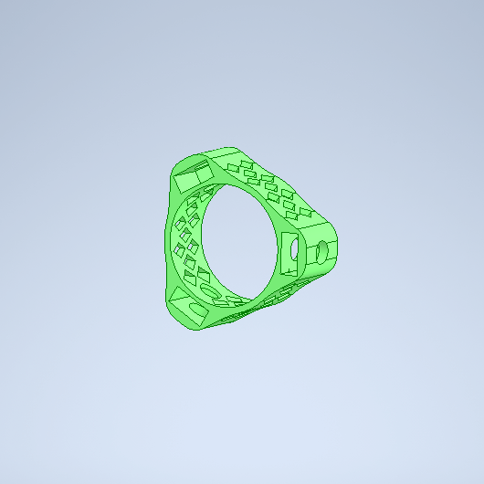
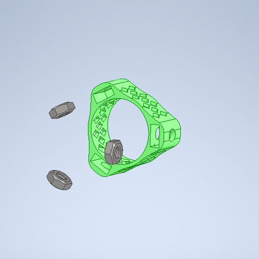
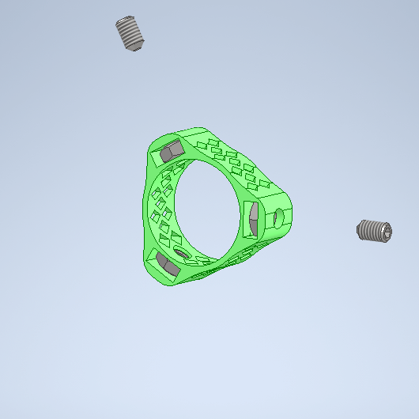
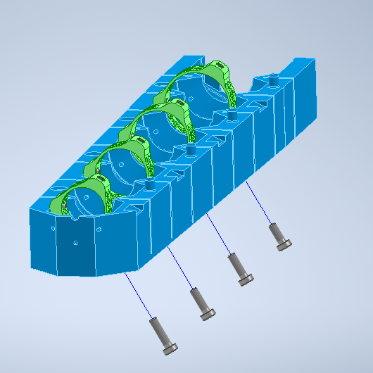
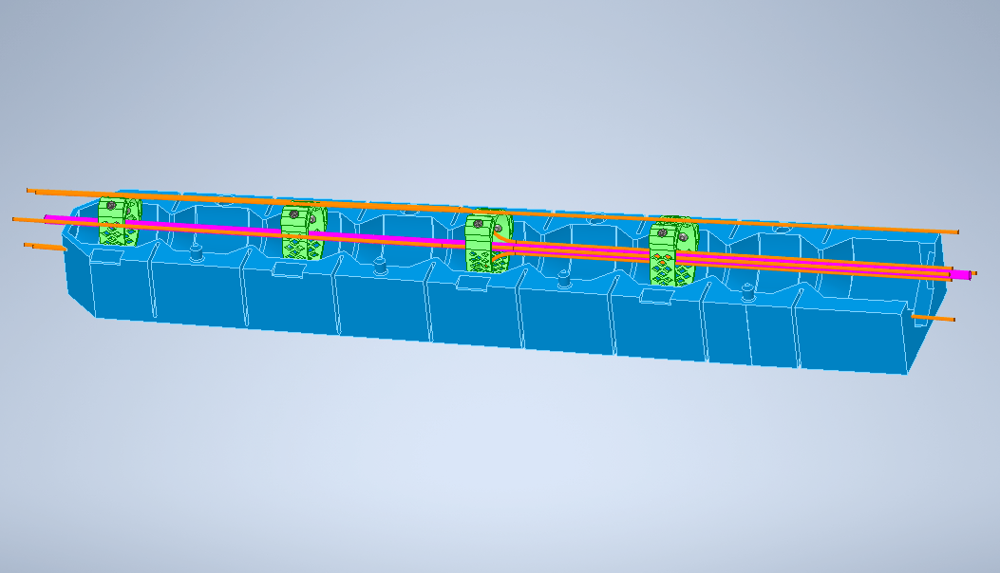
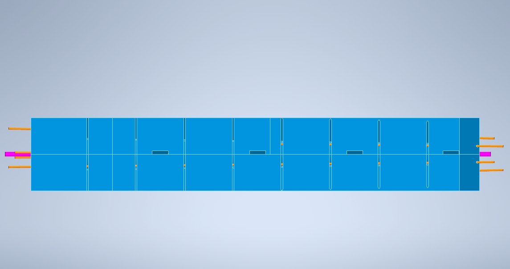
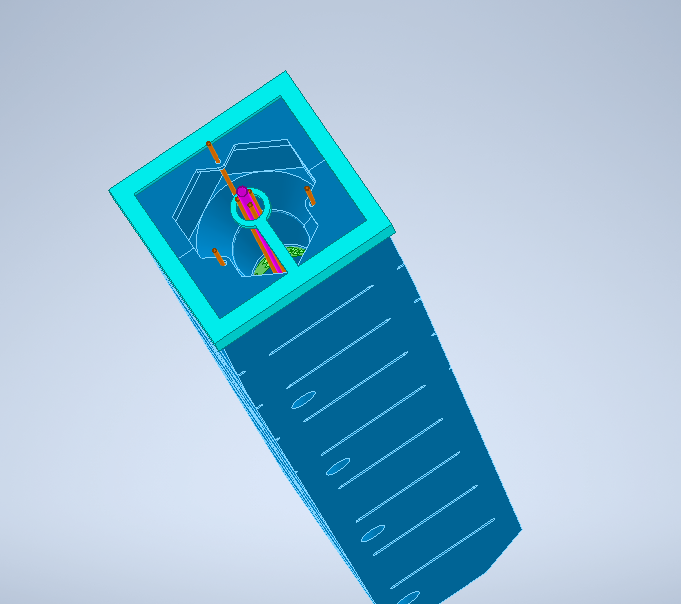

# Manufacturing Instructions: `RT6` Tapered robot 6 strings
## Required Parts:
| Part | Qty. | File Path |
|------|------|-----------|
| **3D-Printed Parts** | | |
| `RT6-M-002` | 1 | `20_Robots/RT6_Robot_tapered-6strings/20_Molding/Mold/...` |
| `RT6-M-003` | 1 | `20_Robots/RR_Robot_retractable/20_Molding/Mold/...` |
| `RT6-M-004` | 1 | `20_Robots/RR_Robot_retractable/20_Molding/Mold/...` |
| `RT6-P-004` | 1 | `20_Robots/RT6_Robot_tapered-6strings/10_Product/Parts/...` |
| `RT6-P-005` | 1 | `20_Robots/RT6_Robot_tapered-6strings/10_Product/Parts/...` |
| `RT6-P-006` | 1 | `20_Robots/RT6_Robot_tapered-6strings/10_Product/Parts/...` |
| `RT6-P-007` | 1 | `20_Robots/RT6_Robot_tapered-6strings/10_Product/Parts/...` |
| **Other Materials** | | |
| Tubes thin (ca. 30 cm) | 6 | |
| Tubes thick (ca. 30 cm) | 1 | |
| Spring steel wire | 6 | |
| Silicone (HT 33 or HT 45) | ? g | |
| screws (M3x?) | 4 | | 
| grub screws (M3x?) | 8 | |
| nuts (M3) | 12 | |
| imu circuit boards |  | |

## Step 1: Prepare the mounting points

 

## Step 2 Put in the other parts

Put the spring steal wire into the tubes to make them stay straight.

Then put everything together. The imu circuit boards should go into the middle of the mounting points(green).

Make sure that the wires stay in the middle of the mold by taping it to the thick tube.

> [!IMPORTANT]
> You cant replace cast-in parts after the silicone is cured. Therefore make sure that the circuit boards and imus are working before starting to work with silicone.
 

 

