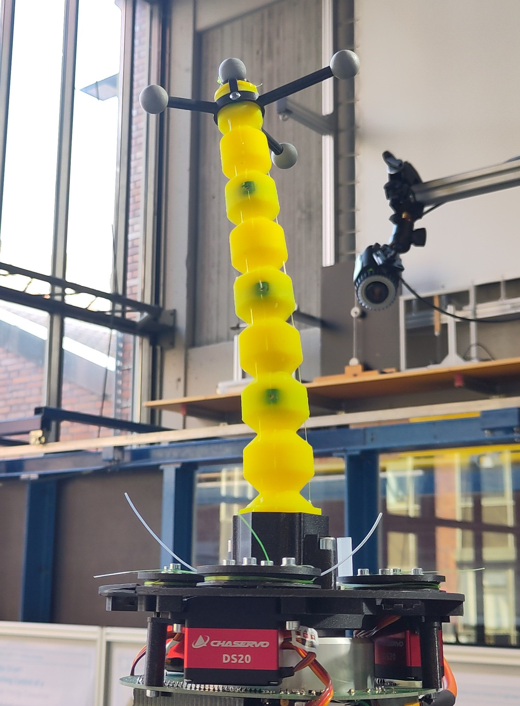
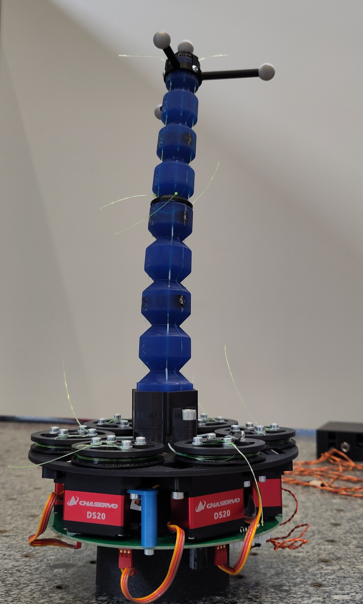
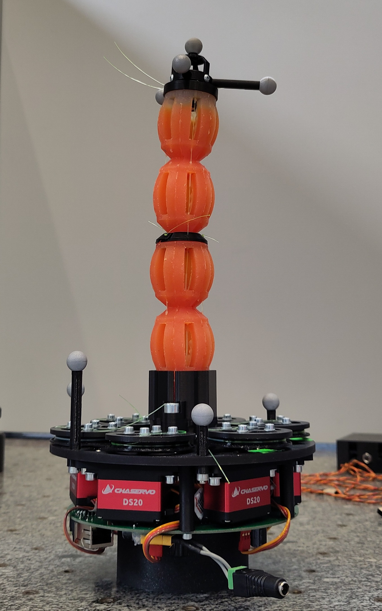
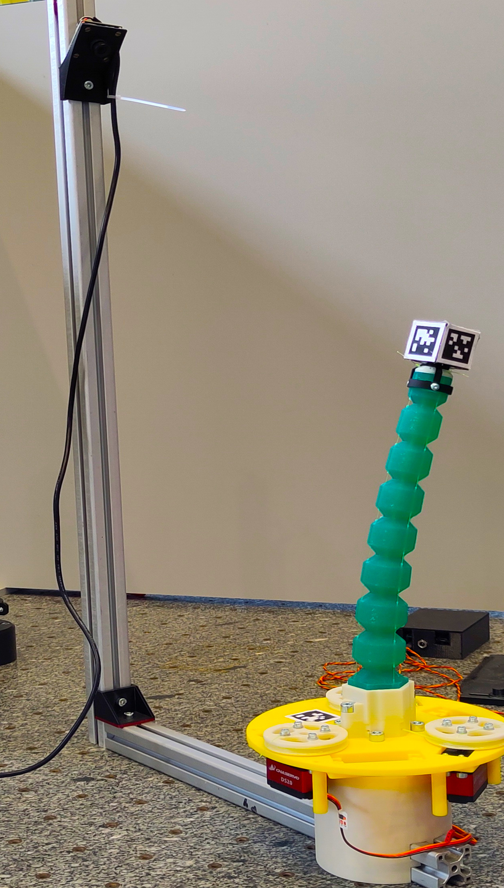
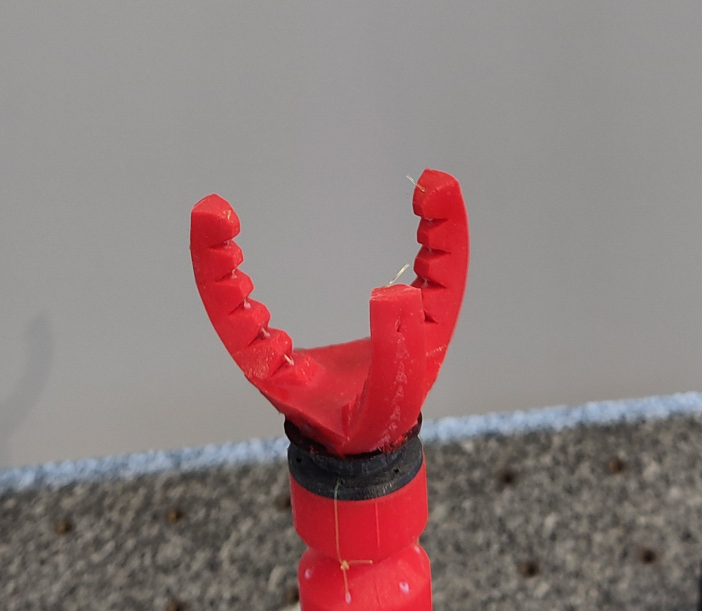
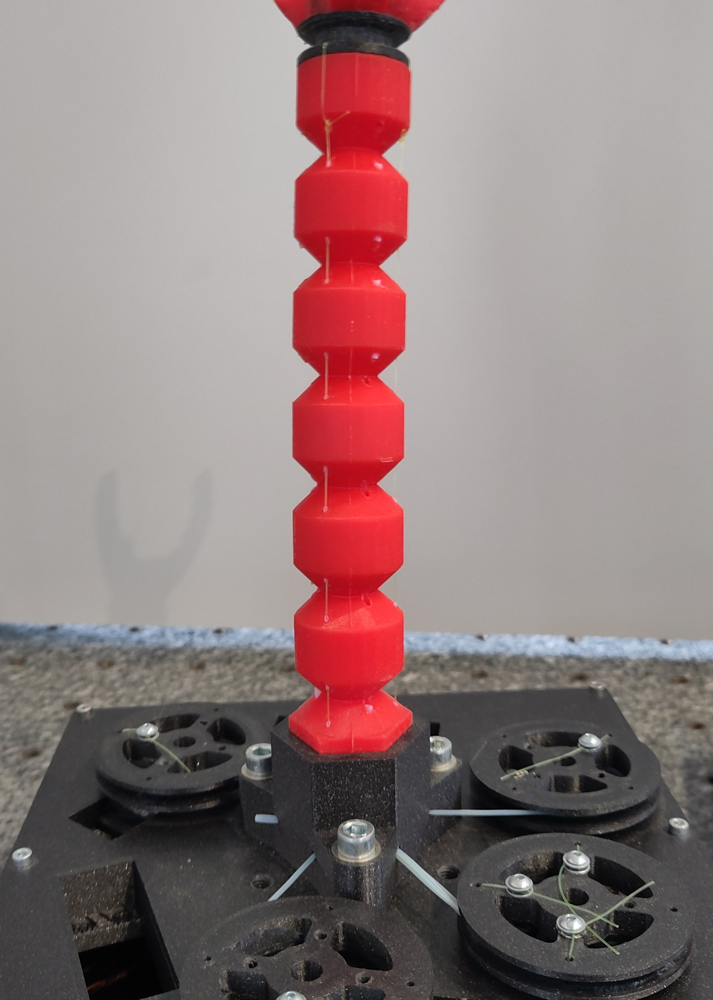

# Robots
There are various robots in use. For every robot there is a directory in the [cloud](www.todo.de), containing the corresponding CAD files and documentation.

The `00_Documentation` directory of each robot contains relevant documentation, such as the bill of materials and, where available, manufacturing instructions.

For information about the CAD directory structure and file naming conventions, see [CAD file structure](file-structure.md).

## Existing Robots

- [`RT3`](#rt3) - Tapered 3-String Robot
- [`RT6`](#rt6) - Tapered 6-String Robot
- [`RR`](#rr) - Retractable Robot
- [`RL`](#rl) - Introduction to Robotics Robot
- [`GR`](#gr) - Gripper
- [`RS`](#rs) - Straight 6 Element Robot

## `RT3` – Tapered 3-String Robot

This robot is the standard design of the MuM soft robots. The RT3 version consists of one element, three strings. 

[CAD-Files](www.todo.de)

 

## `RT6` – Tapered 6-String Robot

This robot is the standard design of the MuM soft robots. The RT6 versin consists of two elements, each actuated by three strings. 

[CAD-Files](www.todo.de)
[Mold instructions](Molds/rt6_Mold.md)

 

## `RR` – Retractable Robot

The retractable robot is designed to change its length, allowing it to reach a larger workspace. It can be built with either three or six strings.

Known **issues**:
- The mold consists of many individual parts, making the casting process complex.
- The tubes used to reduce friction tend to slip out of their holes.

[Manufacturing instructions](www.todo.de)

[CAD-Files](www.todo.de)

 

## `RL` – Introduction to Robotics Robot

This is the robot that is used in the course '**Introduction to robotics**'. The purpose of this robot is to be controlled with visual localization of the April-Tags

The silicone body of this robot is the [`RT3`](#rt3) - Tapered 3-String Robot.

The Robot is driven by three strings. For this robot we have a special base plate with less servo spaces and an engraved coordinate system to place an April-Tag. The CAD-files also contain the parts of the frame.

[CAD-Files](www.todo.de)

[corresponding software documentation](https://github.com/SoftRobotics-MuM/course-introduction-to-robotics)

 

## `GR` – Gripper

[CAD-Files](www.todo.de)

 

## `RS` – Straight 6 Element Robot 

This is an earlier version of the standard soft robot and is replaced by the `RT6` – Tapered 6-String Robot.

[CAD-Files](www.todo.de)

 
