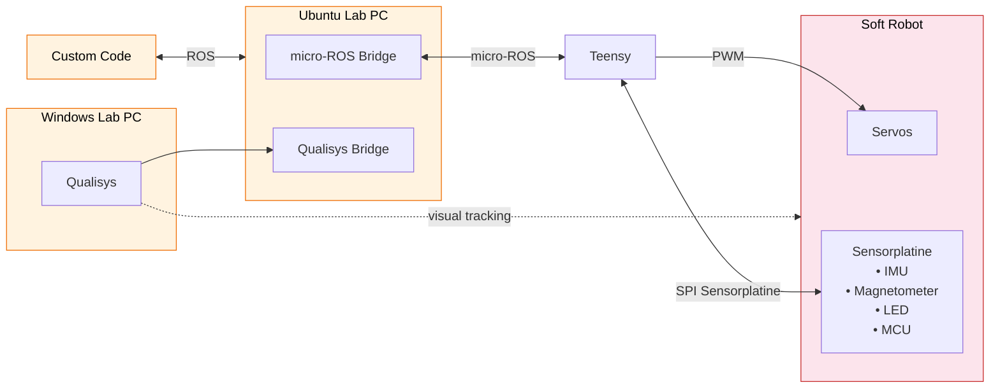

# Software Overview
## System Overview
The basic structure of the software system is visualized here.

## Documentation
### General documentation:
Contains instructions and documentations that are needed to work with the system.
Soft robots
- [micro-ROS Bridge](www.todo.de)
- [Qualisys Bridge](www.todo.de)

Rigid robot
- [dies](www.todo.de)
- [und](www.todo.de)
- [das](www.todo.de)

### Project specific documentations:
Contain documentations for specific projects and are not needed to work with the system.
- [latency Measurement](www.todo.de)
