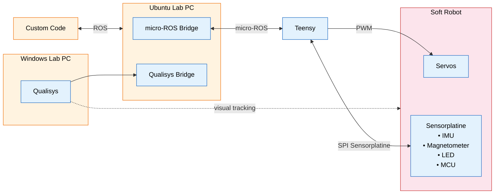

# Software Overview
## System Overview
The basic structure of the software system is visualized here.

## Work With The System
### 🦄 Initial Setup
For the micro-ROS bridge
- You need to [install micro-ROS](micro-ROS.md) on your Ubuntu computer.

The required setup depends on the programming environment you want to use:
- **Matlab** - Follow the [ROS2 in Matlab](ROS2-in-MATLAB.md) documentation.
- **python** or **C++** - Install [ROS2 Jazzy](https://docs.ros.org/en/jazzy/Installation.html).

- [trouble shooting](ROS-Setup_trouble-shooting.md)

For the Qualisys bridge
- The Qualisys bridge is optional and is only required when working with the Qualisys motion capture system.
- Follow the HippoCampus [Qualisys Documentation](https://github.com/HippoCampusRobotics/qualisys_bridge)

### 🐊 Each Session
1. Prepare/connect the robot.
2. start the microros bridge
3. if required star qualisys and the qualisys bride
4. start your custom ros2 nodes
   
### 🐡 Flash The Robot
The robot does not normally need to be flashed before each session.

By default the robots are flashed with the [teensy-hub](https://github.com/SoftRobotics-MuM/teensy-hub) firmware. 

If you need to modify or replace the firmware, follow the [empty firmware documentation](System-Overview.md)

### 🐕 Custom Code
You can write your ROS2 nodes in Python, C++ or Matlab.
- For **Python** or **C++** the [ROS2 documentation](https://docs.ros.org/en/jazzy/index.html) might help.
- For **Matlab** you can use [our documentation](ROS2-in-MATLAB.md) or the [MATLAB documentation](https://de.mathworks.com/help/ros/ros-network-access.html) for more details.
