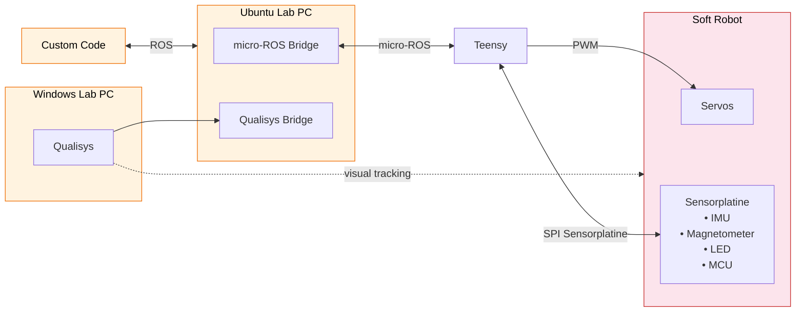

```mermaid
flowchart LR

    Custom["Custom Code"]

    subgraph Ubuntu["Ubuntu Lab PC"]
        MicroROS["micro-ROS Bridge"]
        QualisysBridge["Qualisys Bridge"]
    end

    Teensy["Teensy"]

    subgraph Robot["Soft Robot"]
        Servos["Servos"]
        SensorBoard["Sensorplatine<br/>• IMU<br/>• Magnetometer<br/>• LED<br/>• MCU"]
    end

    subgraph Windows["Windows Lab PC"]
        Qualisys["Qualisys"]
    end

    Custom <-->|ROS| Ubuntu
    MicroROS <-->|micro-ROS| Teensy


    Teensy -->|PWM| Servos
    Teensy <-->|"SPI" Sensorplatine| SensorBoard

    Qualisys --> QualisysBridge
    Qualisys -.-> |visual tracking| Robot

classDef Blau fill:#e3f2fd,stroke:#1565c0,color:#000;
classDef Gelb fill:#fff3e0,stroke:#ef6c00,color:#000;
classDef Rot fill:#fce4ec,stroke:#c62828,color:#000;

class Robot Rot;
class Custom,Windows,Ubuntu Gelb;
```
