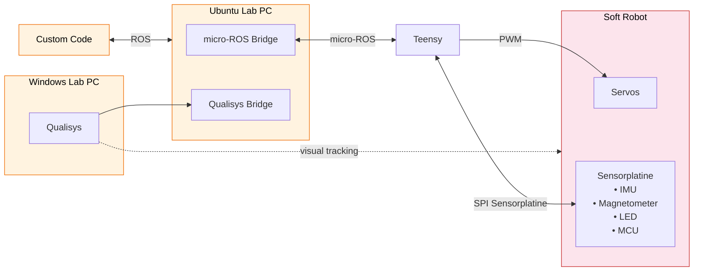

# Software Overview
## System Overview
The basic structure of the software system is visualized here.

## Work With The System
### 🦄 Initial Setup
For the micro-ROS bridge
- You need to [install micro-ROS](www.todo.de) on your Ubuntu computer.

For the custom code
- If you work with **Matlab**, use the [ROS2 in Matlab](www.todo.de) documentatin.
- If you work with **python** or **C++**, install [ROS2 Jazzy](https://docs.ros.org/en/jazzy/Installation.html).

- [trouble shooting](www.todo.de)

For the Qualisys bridge
- This is only needed if you want to work with the camera system.
- Follow the HippoCampus [Qualisys Documentation](https://github.com/HippoCampusRobotics/qualisys_bridge)

### 🐡 Flash The Robot
The robot doesn't need to be flashed every time you work with it. By default the robots are flashed with [this](www.todo.de) code. To change that, follow the [not existing documentation](www.todo.de)

### 🐊 Before Each Session

### 🐕 Do Stuff
Flash the robot
